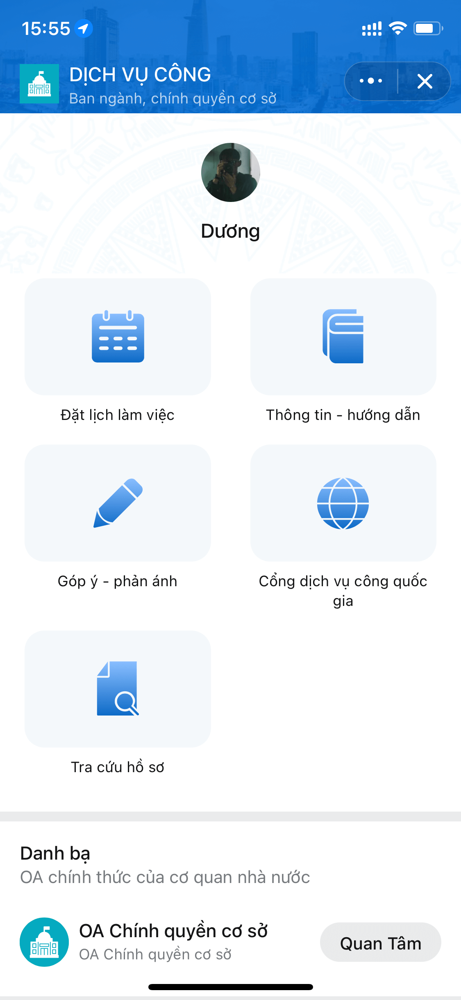
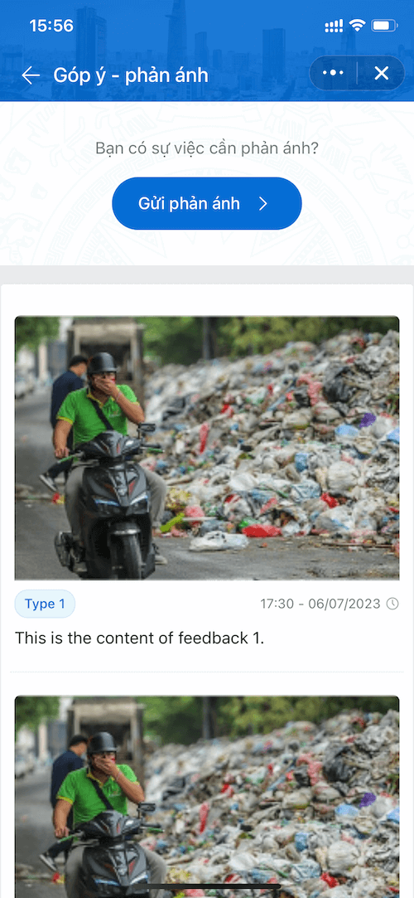
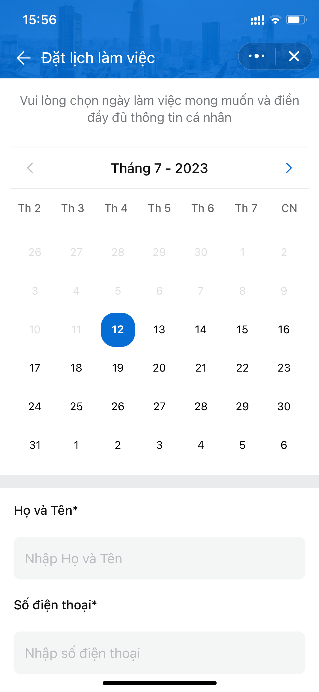
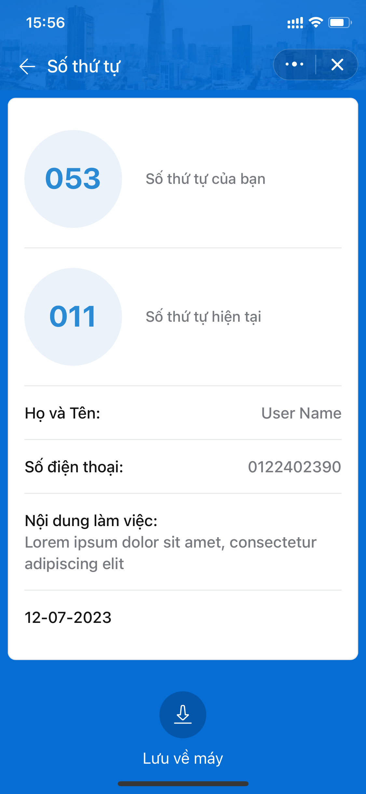

# E Government Template

## Table of Contents

-   [Overview](#overview)
-   [Project Structure](#project-structure)
-   [State Management](#state-management)
-   [Installation](#installation)
-   [Configuration](#configuration)
-   [Scripts](#scripts)
-   [License](#license)

## Overview

Template for E Government Zalo Mini App

### Screen shot

|                                                                        |                                                                        |                                                                        |
| :--------------------------------------------------------------------: | :--------------------------------------------------------------------: | :--------------------------------------------------------------------: |
|  |  |  |
|  |  |  |

### Demo

Scan this QR by Zalo to preview Sample Mini App


## Project Structure

The project follows a specific structure to organize its codebase. Here's an overview of the key directories and their contents:

```shell
.
├── src
│   ├── components
│   │   ├── UIComponent1
│   │   │   ├── index.ts
│   │   │   └── UIComponent1.tsx
│   │   ├── UIComponent2
│   │   │   ├── index.ts
│   │   │   └── UIComponent2.tsx
│   │   └── ...
│   ├── services
│   │   ├── services.ts
│   │   ├── services.mock.ts
│   │   └── zalo.ts
│   ├── mock
│   │   ├── db.json
│   ├── pages
│   │   ├── [PageName]
│   │   │   ├── index.ts
│   │   │   └── [PageName].tsx
│   │   ├── Page1
│   │   │   ├── index.ts
│   │   │   └── Page1.tsx
│   │   ├── Page2
│   │   │   ├── index.ts
│   │   │   ├── Section1.tsx
│   │   │   ├── Section2.tsx
│   │   │   └── Page2.tsx
│   │   └── ...
│   ├── constants
│   │   └── common.ts
│   ├── utils
│   ├── types
│   ├── css
│   │   ├── global.css
│   │   ├── tailwind.css
│   └── assets
│       ├── image1.png
│       ├── image2.png
│       └── ...
├── .env
├── .env.production
├── .env.development
├── .gitignore
├── package.json
└── README.md
```

-   **`src/components`**: Contains UI components and common components used throughout the project.
-   **`src/pages`**: Contains pages and page sections. Each page represents a specific route or view of the application.
-   **`src/pages/index`**: Contains route configurations for the pages. This is where you define the routing logic of the application.
-   **`src/constants`**: Defines constants used in the project, such as API endpoints and other configuration values.
-   **`env.production` and `env.development`**: Edit the API base URL in these environment files (`VITE_BASE_URL`) based on your deployment environment.
-   **`.env`**: Contains configuration variables for the application. Make sure to update the `APP_ID` in this file.
-   **`src/utils`**: Contains utility functions that can be used across the project.
-   **`src/types`**: Contains type declarations for better type safety and code documentation.
-   **`src/css`**: Contains global CSS styles and Tailwind CSS configurations.
-   **`src/assets`**: Contains static assets such as images, fonts, and other resources used in the project.
-   **`src/mock`**: fake data for testing UI
-   **`src/services`**:
    -   **`services.ts`**: This file contains the implementation for service call APIs.
    -   **`services.mock.ts`**: This file is used for mocking services during UI testing.
    -   **`zalo.ts`**: This file contains the implementation for Zalo APIS call.

## State Management

[Zustand](https://github.com/pmndrs/zustand) is used for state management in this project. The state is organized into different slices based on the feature it belongs to. The following slices are available:

-   **`authSlice`**: Manages authentication-related state.
-   **`appSlice`**: Manages application-level state, including notifications and theme settings.
-   **`feedbackSlice`**: Handles feedback-related state for future features.
-   **`informationGuideSlice`**: Manages guideline-related state for a specific feature.
-   **`organizationSlice`**: Handles organization information-related state for a specific feature.
-   **`scheduleSlice`**: Manages appointment scheduling-related state for a specific feature.

The state management code can be found in the `/src/store` directory.

## Installation

To install the project dependencies, please follow the steps below:

1. Make sure you have [Node.js](https://nodejs.org) installed on your machine.

2. Open a terminal or command prompt and navigate to the project's root directory.

3. Run the following command to install the project dependencies using **yarn**:

    ```shell
    yarn install
    ```

    If you prefer to use **npm**, run the following command instead:

    ```shell
    npm install
    ```

    This will download and install all the necessary packages defined in the `package.json` file.

## Configuration

To configure the project for your specific deployment environment and application settings, follow the instructions below:

### API Base URL

-   Edit the API base URL in the environment files located at `env.production` and `env.development`. Look for the variable `VITE_BASE_URL` and update it with the appropriate URL for your backend API.

### API Endpoints

The API endpoints are defined in the `src/constants/common.ts` file. Modify the values to match your desired endpoints. You can replace the values of the endpoints with the pattern name_endpoints. Here's an updated example:

```ts
export const API = {
    GET_ORGANIZATION: "/get_organization_api",
    SEARCH_PROFILES: "/search_profiles_api",
    GET_ARTICLES: "/get_articles_api",
    FEEDBACK: "/feedback_api",
    FEEDBACK_TYPES: "/feedback_types_api",
    INFORMATION_GUIDE: "/information_guide_api",
    UPLOAD_IMAGE: "/upload_image_api",
    CREATE_SCHEDULE: "/create_schedule_api",
    GET_SCHEDULE: "/get_schedule_api",
};
```

### Application ID

-   Update the `APP_ID` in the `.env` file with the desired Zalo Mini App ID.

## Scripts

The following scripts are available to run in the project:

-   **`npm start`**: Starts the project.
-   **`npm deploy`**: Deploys the project.

## License

This project owned by **Zalo Mini App team**
